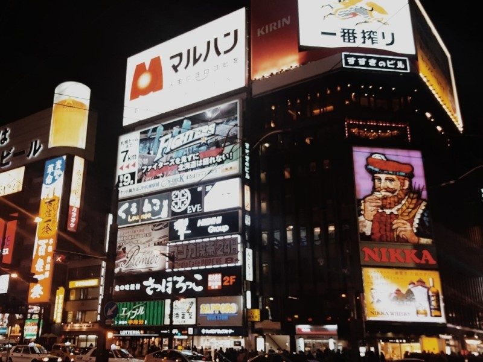
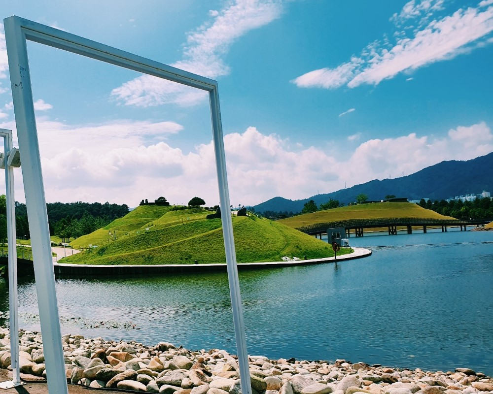

## ✍🏻 자기소개 페이지 만들기

오늘은 사전스터디 1주차 과제였던 자기소개 페이지 만들기에 대한 게시글을 써보려 한다. 사실 1~2년동안 먼저 프론트엔드 개발자가 되기 위해서 혼자 나름대로의 공부를 해왔다고 생각했는데, 이번 과제를 통해서 아직 내가 한~~~~~~~~~참 부족한 모시깽이라는 것을 느꼈다.. 그래도 기존에 내가 사용했었던 코드나 드림코딩 포트폴리오를 만들때 배웠던 코드들은 유용하게 활용할 수 있었다. 

> [완성된 자기 소개 페이지](https://kyeom1997.github.io/wecode_week_1/)

### 🎞️ 레이아웃


대략적인 레이아웃은 이렇게 설정하였다. 사실 여러 개의 페이지를 연결해서 만들까도 생각했지만, 아직은 멀티 페이지 애플리케이션으로 구현을 할 수 밖에 없기 때문에, 속도 저하 등의 효율성이 떨어진다고 생각해서 한 페이지에서 navbar를 통한 버튼으로 이동할 수 있게 레이아웃을 설정하였다.

### ✨ 사용한 코드들


**1. Header**

```html
<header>
        <div class="page_logo">
            <i class="fas fa-male"></i>
            <a href="#">Kyeom's Page</a>    
        </div>
        <nav id="navbar">
            <ul class="navbar_menu">
                <li class="navbar_menu_item" data-link="#me">About Me</li>
                <li class="navbar_menu_item" data-link="#skills">Skills</li>
                <li class="navbar_menu_item" data-link="#hobby">Hobby</li>
                <li class="navbar_menu_item" data-link="#gallery">Gallery</li>
                <li class="navbar_menu_item" data-link="#contact">Contact</li>
            </ul>
        </nav>
    </header>
```

헤더의 html 태그다.

```css
/* Header */

header {
  height: 1300px;
  position: relative;
}

header:after {
  background-image: url(imgs/header_bg.jpg);
  background-repeat: no-repeat;
  background-position: center;
  background-size: cover;
  background-attachment: fixed;
  top: 0;
  left: 0;
  position: absolute;
  opacity: 0.5 !important;
  z-index: -1;
  content: "";
  width: 100%;
  height: 100%;
}

.page_logo {
  display: flex;
  font-weight: var(--weight-semi-bold);
  justify-content: center;
  font-size: 70px;
  padding: 300px;
  padding-bottom: 200px;
}

.page_logo i {
  margin: 20px;
}

.page_logo:hover {
  transition: 0.7s;
  color: var(--color-white);
}

.navbar_menu {
  display: flex;
  justify-content: center;
  font-size: var(--font-medium);
}

.navbar_menu_item {
  padding: 8px 12px;
  margin: 0 4px;
  cursor: pointer;
  border: 1px solid transparent;
  border-radius: var(--size-border-radius);
}

.navbar_menu_item:hover {
  transition: 0.7s;
  border: 1px solid var(--color-white);
  background-color: var(--color-black);
  color: var(--color-white);
  border-radius: var(--size-border-radius);
}
```

헤더의 CSS 속성이다.

헤더에서 가장 중점적으로 구현하고자 한 기능은 스크롤 시 배경화면 고정과, navbar 버튼 클릭시에 해당 레이아웃으로 이동하는 기능이었다.

스크롤 시 배경화면 고정은, 현재 배달의 민족 홈페이지나 스타벅스 홈페이지에서도 볼 수 있는 기능이라, '와 저건 어떤 엄청난 코드를 사용해서 구현한 복잡한 기능일까?' 하는 두려움과 설렘이 있었다. 그러나, 이를 구현하기에는 생각보다 너무나도 간단한 코드 한줄만이 필요했다.

```css
background-attachment: fixed;
```

background-attachment 속성을 fixed로 설정하면, 배경을 뷰포트에 대해 고정하기 때문에 스크롤을 해도 배경은 함께 스크롤되지 않고 고정된 상태로 남아있게 된다. 다만 여기서 새로운 문제가 발생하게 되는데, 기존 `<header>` 태그에 background 속성과 opacity 속성을 적용하면, header 태그 내부에 존재하는 page_logo 와 navbar 요소까지 함께 투명도가 적용되는 것이었다.

이를 해결하기 위해서는, CSS의 가상요소인 `::after`를 통해 `<header>`의 자식 의사 요소를 추가하면 된다. 기존 `<header>` 태그의 자식 의사 요소에 background 요소와 opacity를 설정한 후, `z-index`를 통해 해당 요소의 z축을 뒤로 보내면, 배경화면에만 opacity가 적용됨을 확인할 수 있다.


navbar의 버튼을 클릭해서 해당 레이아웃으로 이동하는 기능은 Javascript가 필요했다. 우선 dataset을 활용하기 위해 navbar 메뉴의 HTML 요소에서 dataset attribute를 customize했다.

```html
<nav id="navbar">
	<ul class="navbar_menu">
		<li class="navbar_menu_item" data-link="#me">About Me</li>
		<li class="navbar_menu_item" data-link="#skills">Skills</li>
		<li class="navbar_menu_item" data-link="#hobby">Hobby</li>
		<li class="navbar_menu_item" data-link="#gallery">Gallery</li>
		<li class="navbar_menu_item" data-link="#contact">Contact</li>
	</ul>
</nav>
```

dataset attribute를 customize 하기 위해서는 `data-(변수명)` 식으로 작성하고 value 값을 주면 된다. 여기서는 dataset에 link라는 변수를 주고 value 값으로 해당 레이아웃들의 id 값을 주었다.


```js
// function about scroll smoothly
function scrollIntoView(e) {
  const scrollTo = document.querySelector(e);
  scrollTo.scrollIntoView({
    behavior: "smooth",
  });
}

// Handle scrolling when tapping on the navbar menu
const navbarMenu = document.querySelector(".navbar_menu");
navbarMenu.addEventListener("click", (event) => {
  const target = event.target;
  const link = target.dataset.link;
  if (link == null) {
    return;
  }
  navbarMenu.classList.remove("open");
  scrollIntoView(link);
});
```

navbar의 js 함수들이다. 우선 버튼을 클릭하면 스크롤되어 해당 레이아웃으로 이동하기 때문에, scrollIntoView 라는 함수를 정의해 해당 element로 `Window.scrollTo()` 되게 하였다. 여기서 behavior: "smooth" 값을 적용해 조금 더 부드러운 스크롤이 가능하도록 구현하였다.

그리고 `navbar_menu`의 class 값을 불러와 addEventListener로 click 이벤트를 등록하였다. 여기서 dataset의 link 변수를 불러오기 위해 target이라는 변수에 `event.target`값을, link라는 변수에 `target.dataset.link` 값을 저장하였다. link 값이 null인 경우에는 return 명령문을, link 값이 유효할 때는 앞서 선언한 scrollIntoView 함수를 통해 link 값에 할당된 레이아웃으로 이동하도록 이벤트 핸들러를 등록하였다.


**2. About Me**

레이아웃의 시작인 About Me 레이아웃이다. 아무래도 HTML & CSS를 중점적으로 활용하여 만드는 자기소개 페이지이다 보니까 CSS animation 속성들을 많이 활용하고 싶었다. 그래서 조금은 뜬금없지만 내 사진이 빙글빙글 돌게 하는 건 어떨까 싶어 적용해 보았다.

```css
#me img {
  display: block;
  margin: 30px auto;
  width: 400px;
  height: 400px;
  border-radius: 100% 100% 100% 100%;
}

#me img:hover {
  animation: rotation 2s infinite ease;
  transition: 3s;
}

@keyframes rotation {
  from {
    transform: rotateY(0deg);
  }
  to {
    transform: rotateY(360deg);
  }
}
```

우선 이미지를 둥글게 하기 위해 width와 height 값을 같게 설정한 후, border-radius 값을 50%로 주었다. 그리고 아무래도 내가 계속 빙글빙글 돌아가는 건 좀 어지러울 거 같아서, 마우스를 올렸을 때, 즉 `:hover` 상태일 때만 animation을 주기로 했다. animation은 rotation 2s에 무한대로 돌 수 있도록 infinite를 주었다.

그리고 3D로 도는 듯한 느낌을 주고 싶어서, `@keyframes` 속성을 사용해 Y축 0deg에서 부터 360deg까지 돌도록 설정하였다. 


<center> 빙글 빙글 돌아가는 맷돌~ </center> <br>


아래의 개인 정보들은 hover시 scale(1.2)와 blue color를 주었다.

```css
#me p:hover {
  transform: scale(1.2);
  color: var(--color-blue);
  transition: 0.5s;
}
```


### 🎬 CSS만으로 이미지 슬라이드 만들기

> [참고한 블로그](https://blogpack.tistory.com/815)

대다수의 이미지 슬라이드는 자바스크립트를 활용하여 만들지만, 이번에는 CSS와 HTML만으로 이미지 슬라이드를 만들어 보는 건 어떨까 해서 만들어 보았다. 구글링해보니 꽤 많은 수의 포스트가 있었고, 그 중에서 가장 마음에 드는 블로그의 포스트를 참조하여 구현해 보았다.

```html
<div class="slider">
            <input type="radio" name="slide" id="slide1" checked>
            <input type="radio" name="slide" id="slide2">
            <input type="radio" name="slide" id="slide3">
            <input type="radio" name="slide" id="slide4">
            <input type="radio" name="slide" id="slide5">
            <input type="radio" name="slide" id="slide6">
            <input type="radio" name="slide" id="slide7">
            <input type="radio" name="slide" id="slide8">
            <input type="radio" name="slide" id="slide9">
            <ul id="imgholder" class="imgs">
                <li></li>
                <li></li>
                <li></li>
                <li></li>
                <li></li>
                <li></li>
                <li></li>
                <li></li>
                <li></li>
            </ul>
            <div class="bullets">
                <label for="slide1">&nbsp;</label>
                <label for="slide2">&nbsp;</label>
                <label for="slide3">&nbsp;</label>
                <label for="slide4">&nbsp;</label>
                <label for="slide5">&nbsp;</label>
                <label for="slide6">&nbsp;</label>
                <label for="slide7">&nbsp;</label>
                <label for="slide8">&nbsp;</label>
                <label for="slide9">&nbsp;</label>
            </div>
        </div>
```

슬라이드의 HTML 구조이다. 슬라이드의 이동은 input type의 라디오 박스를 클릭하여 이동하게 구현하였고, 실제 클릭 이동 구현은 하단에 bullets라는 label 태그를 만들어 라디오 박스와 연동되게 만들었다. 즉, 하단의 bullets를 클릭하면 라디오 박스가 클릭되어 이동하게 되는 것이다.

```css
.slider {
  width: 800px;
  height: 600px;
  position: relative;
  padding-top: 50px;
  max-width: 100%;
  margin: 0 auto;
  overflow: hidden; /* 현재 슬라이드 오른쪽에 위치한 나머지 슬라이드 들이 보이지 않도록 가림 */
  z-index: 0;
}

.slider input[type="radio"] {
  display: none;
}
```

슬라이드의 기본 CSS 구조이다. `margin: 0 auto;`를 주어 슬라이드를 가운데 정렬하고, `overflow: hidden;` 속성을 통해 현재 슬라이드 오른쪽에 위치한 나머지 이미지들이 보이지 않도록 하였다. 라디오 박스와 연결된 bullets를 클릭하면 우측에 위치한 보이지 않는 이미지들이 좌측으로 이동하며 보여지게 되는 구조이다.

```css
ul.imgs {
  padding: 0;
  margin: 0;
  list-style: none;
}

ul.imgs li {
  position: absolute;
  left: 640px;
  transition-delay: 1s; /* 새 슬라이드가 이동해 오는 동안 이전 슬라이드 이미지가 배경이 보이도록 지연 */
  width: 800px !important;
  padding: 0;
  margin: 0;
}
```

슬라이드 이미지 목록의 css 구조이다. `left: 640px;`를 줘서 기본적으로 슬라이드 영역 크기 오른쪽에 위치하게 하고, 개별 슬라이드의 transition delay를 1초를 줘서 슬라이드가 이동하는 동안 배경이 웹 페이지 배경으로 보이는 문제를 해결해준다.

```css
.bullets {
  position: absolute;
  left: 50%;
  transform: translateX(-50%);
  bottom: 20px;
  z-index: 2;
}

.bullets label {
  display: inline-block;
  border-radius: 50%;
  background-color: rgba(0, 0, 0, 0.55);
  width: 20px;
  height: 20px;
  cursor: pointer;
}
/* 현재 선택된 불릿 배경 흰색으로 구분 표시 */
.slider
  input[type="radio"]:nth-child(1):checked
  ~ .bullets
  > label:nth-child(1) {
  background-color: #fff;
}

(...)
```
bullets의 CSS 구조이다. bullets는 라디오 박스와 조합된 `<label>` 태그로 만든다. `<label>` 태그를 슬라이드 하단 중앙에 배치한 후, 선택된 bullets를 흰색으로 구분 표시했다.

```css
.slider input[type="radio"]:nth-child(1):checked ~ ul.imgs > li:nth-child(1) {
  left: 0;
  transition: 0.5s;
  z-index: 1;
}
.slider input[type="radio"]:nth-child(2):checked ~ ul.imgs > li:nth-child(2) {
  left: 0;
  transition: 0.5s;
  z-index: 1;
}
.slider input[type="radio"]:nth-child(3):checked ~ ul.imgs > li:nth-child(3) {
  left: 0;
  transition: 0.5s;
  z-index: 1;
}
.slider input[type="radio"]:nth-child(4):checked ~ ul.imgs > li:nth-child(4) {
  left: 0;
  transition: 0.5s;
  z-index: 1;
}

(...)
```

가장 중요한 슬라이드 이동 애니메이션 CSS 구조이다. bullets를 클릭하면 해당 순서의 슬라이드가 `left: 0` 처리되어 왼쪽으로 이동된다. 그리고 새로 들어오는 슬라이드는 현재 슬라이드보다 위쪽에 표시되어야 하기 때문에 z-index를 1로 설정하였다. 


슬라이드가 완성된 모습이다!

### 🔝 Arrow - up 버튼 만들기 & Transparent Navbar

페이지가 하단으로 내려갔을 때, 클릭시에 최상위 레이아웃인 header로 한번에 이동하는 버튼을 구현해 보았다. 

```html
<button class="arrow-up">
	<i class="fa-solid fa-angles-up"></i>
	<br><p>Let's go up!</p>
</button>
```

arrow-up 버튼의 HTML 구조이다. 버튼의 디자인은 [fontawesome](https://fontawesome.com/)에서 가져왔다. 그리고 해당 버튼의 기능을 알 수 있도록 `p` 태그로 설명을 적어 놓았다.

```css
.arrow-up {
  position: fixed;
  bottom: 20px;
  width: 150px;
  height: 200px;
  right: 10px;
  font-size: 50px;
  color: var(--color-black);
  border-style: none;
  background: none;
  opacity: 0;
  transition: all var(--animation-duration) ease-in;
  pointer-events: none;
}

.arrow-up.visible {
  opacity: 1;
  pointer-events: auto;
  cursor: pointer;
}

.arrow-up.visible:hover {
  animation: up-down 0.5s infinite ease-in-out alternate;
}
```

arrow-up 버튼의 CSS 구조이다. 여기서 .visible로 구분을 해놓은 이유는, arrow-up 버튼이 현재 웹사이트가 header에 위치해 있을때는 보이지 않다가 header에서 벗어날 때만 나타나도록 구현할 것이기 때문이다. `fixed`로 브라우저에 위치를 고정하고, `opacity`로 visible일때와 아닐때를 구분하였다. 또한 visible이 아닐때는 `pointer-events`를 none으로 설정해 클릭해도 아무런 기능을 수행하지 않도록 하였다.

마우스를 올렸을 때 버튼을 누르게 끔 hover시에 위 아래로 움직이는 animation 효과 또한 추가하였다.

```js
// Show "arrow up" button when scrolling down
const home = document.querySelector("#header");
const homeHeight = home.getBoundingClientRect().height;
const arrowUp = document.querySelector(".arrow-up");
document.addEventListener("scroll", () => {
  if (window.scrollY > homeHeight / 2) {
    arrowUp.classList.add("visible");
  } else {
    arrowUp.classList.remove("visible");
  }
});

// Handle click on the "arrow up" button
arrowUp.addEventListener("click", () => {
  scrollIntoView("#header");
});
```

arrow-up 버튼의 Javascript 파일이다. 우선 header의 height를 homeHeight라는 변수에 할당해 `window.scrollY`, 즉 사용자가 수직으로 header의 height / 2 만큼 스크롤 하였을때 arrow-up 버튼에 visible classList를 추가하도록 하였다. 즉, header의 반 이상 스크롤 하였을 시에 `arrow-up.visible`이 되어 화면에 나타나게 되는 것이다. 버튼을 클릭시에는 앞서 선언한 scrollIntoView 함수를 통해 header의 id 값으로 이동하게 하는 이벤트 핸들러를 등록하였다.


이와 비슷한 방식으로 transparent Navbar도 구현할 수 있었다.


